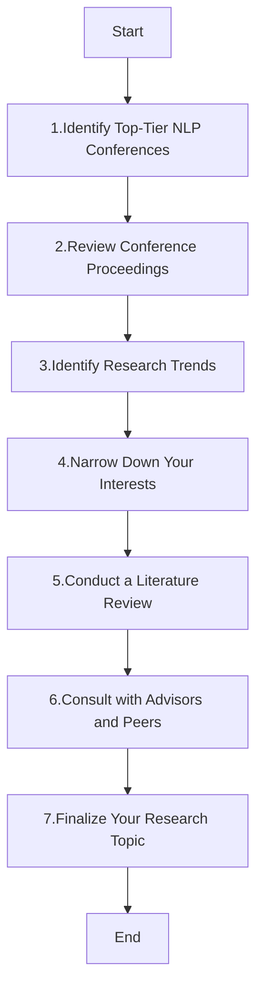
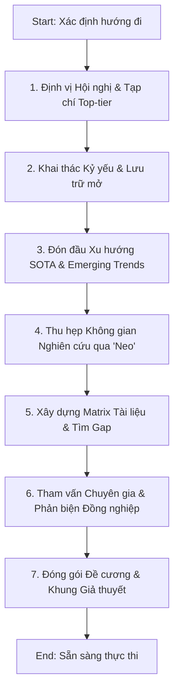

## 📚 Process to select a "Research topic"

**1. Identify Top-Tier NLP Conferences**
Top-tier NLP conferences include:
  -  ACL (Association for Computational Linguistics)
  -  NAACL (North American Chapter of the Association for Computational Linguistics)
  -  EMNLP (Conference on Empirical Methods in Natural Language Processing)
  -  COLING (International Conference on Computational Linguistics)
  -  EACL (European Chapter of the Association for Computational Linguistics)
  -  AAAI (Association for the Advancement of Artificial Intelligence, for its NLP tracks)
  -  NeurIPS (Conference on Neural Information Processing Systems, for its NLP tracks)
    
**2. Review Conference Proceedings**
  -  Access Conference Papers: Visit the conference websites or digital libraries like ACL Anthology, arXiv, or specific conference archives.
  -  Download Proceedings: Get the proceedings of the most recent conference editions.
  -  Read Abstracts and Introductions: Skim through the abstracts and introductions to get a high-level understanding of the topics covered.
    
**3. Identify Research Trends**
  -  Frequent Topics: Look for recurring themes and topics in the papers.
  -  Hot Topics: Identify hot topics by seeing which papers have the most citations or mentions on platforms like Google Scholar, Semantic Scholar, and social media.
  -  Emerging Areas: Pay attention to new and emerging areas that are gaining traction.
    
**4. Narrow Down Your Interests**
  -  Personal Interest: Select topics that personally interest you and align with your career goals.
  -  Relevance and Impact: Consider the practical relevance and potential impact of the research topic in the NLP field and beyond.
  -  Feasibility: Evaluate whether you have the resources (data, tools, expertise) to work on the topic.
 
**5. Conduct a Literature Review**
  -  Deep Dive into Selected Topics: Read key papers thoroughly to understand the methodologies, experiments, results, and conclusions.
  -  Identify Gaps: Look for gaps in the existing research that you could potentially fill with your work.
  -  Review Related Work: Explore the related work sections of papers to find more relevant research and understand the context.
    
**6. Consult with Advisors and Peers**
  -  Seek Feedback: Discuss your selected topics with your academic advisors, mentors, and peers to get feedback and suggestions.
  -  Collaborate: Consider collaborating with others who have expertise or interest in the topic.
    
**7. Finalize Your Research Topic**
  -  Narrow Focus: Narrow down your topic to a specific research question or problem.
  -  Formulate Hypothesis: Formulate a clear research hypothesis or objective.
  -  Plan Your Research: Outline a preliminary research plan, including methodology, data requirements, and potential experiments.

**Example Process**
-  Identify Conferences: ACL, EMNLP.
-  Access Proceedings: Download proceedings from ACL 2023 and EMNLP 2023.
-  Review Abstracts: Skim through abstracts to note trends like transformer models, few-shot learning, and multilingual NLP.
-  Identify Trends: Notice an emerging trend in NLP applications for low-resource languages.
-  Narrow Interests: Interested in multilingual NLP due to background in multiple languages.
-  Literature Review: Read key papers on multilingual NLP and identify a gap in domain adaptation for low-resource languages.
-  Consult Advisors: Discuss the idea with advisors and receive positive feedback.
-  Finalize Topic: Decide on "Domain Adaptation Techniques for Low-Resource Multilingual NLP."
By following these steps, you can systematically select a research topic that is relevant, interesting, and feasible for your work in NLP.

## 📅 Conferences / Journals
- NLP:
  - [NeurIPS](https://dblp.uni-trier.de/db/conf/nips/neurips2023.html): Rank A*
  - [ICML](https://dblp.uni-trier.de/db/conf/icml/index.html): Rank A*
  - [ACL](https://dblp.uni-trier.de/db/conf/acl/index.html): Rank A*
  - [AAAI](https://dblp.uni-trier.de/db/conf/aaai/aaai2025.html): Rank A* (divide into multiple tracks like Computer Vision, Education,...)
  - [COLING](https://aclanthology.org/events/coling-2025/#2025coling-main): Rank B
- Top Tier NLP Conferences List: (https://aclanthology.org/)
- AI in Education:
  - [AIED](https://dblp.uni-trier.de/db/conf/aied/aied2023.html): Rank A
  - [Search in AU EDU](https://portal.core.edu.au/conf-ranks/?search=education&by=all&source=CORE2023&sort=atitle&page=1)
- WWW, AI, E-commerce:
  - [WWW](https://dblp.uni-trier.de/db/conf/www/www2024.html): Rank A*
- Knowledge Graph, Information Retrieval:
  - [SIGIR](https://dblp.uni-trier.de/db/conf/sigir/sigir2024.html): Rank A*
- BPM:
  - [BPM](https://dblp.uni-trier.de/db/conf/bpm/index.html): Rank A
## Conferences / Journals Ranking
- Scopus (Conference/Journal): (https://www.scopus.com/sources.uri). Need to use [VNULIB](https://www.vnulib.edu.vn) account
- Conference Ranking (CR, AU): (https://portal.core.edu.au/conf-ranks)
- Journal Ranking (JR): (https://www.scimagojr.com/)

## Conferences / Journals Database / Search engine
- Google Scholars: (https://scholar.google.com/)
- Semantics Scholars: (https://www.semanticscholar.org/)
- DBLP: (https://dblp.uni-trier.de/)
- ArXiv: (https://arxiv.org/) -> for booking only, need to verify more
  
## :newspaper: SOTA Papers
[1] R. Bommasani et al., “On the Opportunities and Risks of Foundation Models.” arXiv, Jul. 12, 2022. doi: 10.48550/arXiv.2108.07258. [Access here](http://arxiv.org/abs/2108.07258)

[2] J. Yang et al., “Harnessing the Power of LLMs in Practice: A Survey on ChatGPT and Beyond,” ACM Trans. Knowl. Discov. Data, vol. 18, no. 6, p. 160:1-160:32, Apr. 2024, doi: 10.1145/3649506. [Access here](https://dl.acm.org/doi/full/10.1145/3649506)

[3] Transformer: A. Vaswani et al., “Attention is All you Need,” in Advances in Neural Information Processing Systems, Curran Associates, Inc., 2017. Accessed: Jul. 17, 2024. [Online]. Available: (https://proceedings.neurips.cc/paper/2017/hash/3f5ee243547dee91fbd053c1c4a845aa-Abstract.html)

[4] BERT: Devlin, J., Chang, M.-W., Lee, K., & Toutanova, K. (2019). BERT: Pre-training of Deep Bidirectional Transformers for Language Understanding. In Proceedings of the 2019 Conference of the North American Chapter of the Association for Computational Linguistics: Human Language Technologies, Volume 1 (Long and Short Papers) (pp. 4171-4186). Minneapolis, Minnesota: Association for Computational Linguistics.(https://arxiv.org/abs/1810.04805)

[5] GPT: Radford, A., Narasimhan, K., Salimans, T., & Sutskever, I. (2018). Improving Language Understanding by Generative Pre-Training. OpenAI. 
(https://www.mikecaptain.com/resources/pdf/GPT-1.pdf)

[6] T5: Raffel, C., Shazeer, N., Roberts, A., Lee, K., Narang, S., Matena, M., Zhou, Y., Li, W., & Liu, P. J. (2020). Exploring the Limits of Transfer Learning with a Unified Text-to-Text Transformer. Journal of Machine Learning Research, 21(140), 1-67.

## 📚 Books
Dive deep into the foundational theories and practical applications of AI and LLMs with these essential readings:
- "Artificial Intelligence: A Modern Approach" by Stuart Russell and Peter Norvig
  - The definitive textbook on AI, providing a thorough overview of the field and foundational concepts critical to the development of LLMs. [Access here](https://people.engr.tamu.edu/guni/csce421/files/AI_Russell_Norvig.pdf)
- "Deep Learning" by Ian Goodfellow, Yoshua Bengio, and Aaron Courville
  - A fundamental text for those interested in the technical underpinnings of deep learning, essential for understanding how LLMs operate. [Access here](http://alvarestech.com/temp/deep/Deep%20Learning%20by%20Ian%20Goodfellow,%20Yoshua%20Bengio,%20Aaron%20Courville%20(z-lib.org).pdf)
- "Speech and Language Processing" by Daniel Jurafsky, and James H. Martin
  - Offers detailed insights into natural language processing, critical for grasping the linguistic techniques that inform LLM development. [Access here](https://web.stanford.edu/~jurafsky/slp3/)
- "Language Models are Few-Shot Learners" by Tom Brown et al.
  - Explores the capabilities of LLMs in learning from limited data, marking a significant advancement in the field. [Access here](https://papers.nips.cc/paper/2020/hash/1457c0d6bfcb4967418bfb8ac142f64a-Abstract.html)
- "Transformers for Natural Language Processing" by Denis Rothman
  - A vital resource for understanding the Transformers architecture, pivotal in modern LLMs. [Access here](https://github.com/Denis2054/Transformers-for-NLP-and-Computer-Vision-3rd-Edition)

## 📺 Online Courses
Enhance your understanding of LLMs with these expertly curated courses:
-  CS224N: Natural Language Processing with Deep Learning (Stanford University)
  - Introduces deep learning techniques in NLP, foundational for comprehending LLMs. [View course](https://web.stanford.edu/class/cs224n/)
- Deep Learning Specialization by Andrew Ng (Coursera)
  - Starts with neural network basics and advances to sequence models crucial for LLMs. [Enroll here](https://www.coursera.org/specializations/deep-learning)
- Natural Language Processing Specialization (Coursera)
  - Focuses on building and deploying NLP models, offering practical experience with LLMs. [Enroll here](https://www.deeplearning.ai/courses/natural-language-processing-specialization/)
- Generative AI for Beginners (Mirosoft)
  - Learn the fundamentals of building Generative AI applications with our 18-lesson comprehensive course by Microsoft Cloud Advocates. [View course](https://github.com/microsoft/generative-ai-for-beginners/)

## 📅 Community
- GitHub and Stack Overflow: Join the community to discuss challenges, share solutions, and advance your knowledge in LLMs. These platforms are ideal for troubleshooting, learning new techniques, and networking with peers.
- Technology Blogs of Leading Corporations</strong>
  - Google AI Blog: Offers insights into Google's latest developments in AI and machine learning, including updates on their work with LLMs. [Visit Google AI Blog](https://ai.googleblog.com/)
  - OpenAI Blog: Provides updates and deep dives into OpenAI's research and applications of LLMs like GPT series. [Visit OpenAI Blog](https://openai.com/blog/)
  - Facebook AI Blog (Meta AI): Features articles on Facebook's advancements in AI research and technology, with a focus on their efforts in NLP and LLMs. [Visit Meta AI Blog](https://ai.facebook.com/blog/)
  - Microsoft AI Blog: Shares developments from Microsoft on their AI technologies, including Azure AI and the latest breakthroughs in language models. [Visit Microsoft AI Blog](https://blogs.microsoft.com/ai/)
- Amazon Science Blog: Provides insights into Amazon's AI innovations, particularly how they leverage LLMs for enhancing customer experiences. [Visit Amazon Science Blog](https://www.amazon.science/)

## 📺 Youtube 
- Mì AI: (https://www.youtube.com/c/M%C3%ACAIblog)
- Việt Nguyễn AI: (https://www.youtube.com/@vietnh1009)
- The AI Advantage: (https://www.youtube.com/@aiadvantage)
- Two minutes papers: (https://www.youtube.com/@TwoMinutePapers)
- AI Blog: (https://www.youtube.com/@venelin_valkov)
- AI Blog: (https://www.youtube.com/@umarjamilai)
- AI Blog: (https://www.youtube.com/@mreflow)
- AI Explained: (https://www.youtube.com/@aiexplained-official)
- DeepLearningAI: (https://www.youtube.com/@Deeplearningai)

## 🧰 Tools and Libraries
Get hands-on experience with these cutting-edge tools and libraries to apply, fine-tune, and deepen your understanding of LLMs in practice:
- Hugging Face Transformers Library
  - Simplifies the application of LLMs across a range of tasks from text generation to translation. [Explore the library](https://huggingface.co/)
- Unsloth AI
  - Provides a platform for users to fine-tune their language models to better suit specific requirements, enhancing natural language processing capabilities. [Visit Unsloth AI](https://unsloth.ai/)
- Prompting Guide
  - An online resource specializing in the use and development of prompting techniques for LLMs, offering guidance and tips for creating effective prompts. [Explore Prompting Guide](https://www.promptingguide.ai)
- OpenAI API
  - Offers powerful API options to interact with advanced LLMs like GPT-3 and GPT-4, facilitating a range of applications from creative writing to technical problem-solving. [Access OpenAI API](https://beta.openai.com/)"
- Together.xyz API
  - A platform that provides APIs for creating and deploying custom language models, enabling users to build powerful NLP applications with high customization potential. [Visit Together.xyz API](https://api.together.xyz/)

## 🎒 Other Courses

Microsoft team produces other courses! Check out:

- [ML for Beginners](https://aka.ms/ml-beginners?WT.mc_id=academic-105485-koreyst)
- [Data Science for Beginners](https://aka.ms/datascience-beginners?WT.mc_id=academic-105485-koreyst)
- [AI for Beginners](https://aka.ms/ai-beginners?WT.mc_id=academic-105485-koreyst)
- [**NEW** Cybersecurity for Beginners](https://github.com/microsoft/Security-101??WT.mc_id=academic-96948-sayoung)
- [Web Dev for Beginners](https://aka.ms/webdev-beginners?WT.mc_id=academic-105485-koreyst)
- [IoT for Beginners](https://aka.ms/iot-beginners?WT.mc_id=academic-105485-koreyst)
- [XR Development for Beginners](https://github.com/microsoft/xr-development-for-beginners?WT.mc_id=academic-105485-koreyst)
- [Mastering GitHub Copilot for AI Paired Programming](https://aka.ms/GitHubCopilotAI?WT.mc_id=academic-105485-koreyst)
- Bài giảng rất hay về Attention và Transformers (https://github.com/microsoft/AI-For-Beginners/blob/main/lessons/5-NLP/18-Transformers/READMEtransformers.md)
- Bài viết hay làm rõ về Transformers kèm ví dụ trực quan trang 57 Kỷ yếu (https://www.dropbox.com/scl/fi/h77ynoxg37ygumczfw3lc/K-y-u-b-n-sau-ch-nh-s-a.pdf?rlkey=rht3r44hu7lfh7gxxq7aamm9g&e=2&dl=0)
- Bài viết hay về BERT (https://phamdinhkhanh.github.io/2020/05/23/BERTModel.html)(https://mccormickml.com/2020/03/10/question-answering-with-a-fine-tuned-BERT/)

groq

http://www.wikicfp.com/cfp/

https://www.deeplearning.ai/courses/

https://paperswithcode.com/

## Evaluation metrics
https://ollama.com/library/llama3.2
https://paperswithcode.com/paper/the-llama-3-herd-of-models

Dưới đây là toàn bộ nội dung lộ trình nghiên cứu và tài nguyên học thuật của bạn đã được tổ chức lại một cách hệ thống, khoa học theo chuẩn Markdown.

Bản cập nhật này đã bổ sung các xu hướng **SOTA tính đến năm 2026** (như Multi-Agent Orchestration, Small Language Models - SLMs, LLM-as-a-Judge, Omni-modal), chuẩn hóa xếp hạng các Hội nghị/Tạp chí hàng đầu theo **CORE Rank A*/A** và **Scimago Q1**, đồng thời tích hợp thêm các công cụ mã nguồn mở và khung đánh giá mới nhất.

---

# 🚀 LỘ TRÌNH CHỌN ĐỀ TÀI & KHÔNG GIAN TÀI NGUYÊN NGHIÊN CỨU AI / NLP

## 📚 Quy trình hệ thống lựa chọn "Đề tài Nghiên cứu"

### 1. Định vị Hội nghị & Tạp chí Top-tier (NLP/AI)

Để đảm bảo tính thời sự và giá trị học thuật, đề tài cần xuất phát từ các nguồn uy tín cao:

* **Hội nghị Thượng đỉnh (CORE Rank A*):** NeurIPS, ICML, ICLR (Đầu bảng về Deep Learning), ACL, EMNLP, KDD, SIGIR.
* **Tạp chí Đầu ngành (Scimago Q1 / ISI):** *IEEE TPAMI*, *JMLR*, *Computational Linguistics*, *ACM Computing Surveys*.

### 2. Khai thác Kỷ yếu & Lưu trữ mở

* **ACL Anthology:** Kho lưu trữ toàn diện cho ACL, EMNLP, NAACL, EACL.
* **OpenReview & arXiv:** Cập nhật các bản preprint trước khi xuất bản chính thức (cần kiểm chứng chéo phương pháp).
* **Papers With Code:** Theo dõi trực quan biểu đồ tiến triển của các benchmark.

### 3. Đón đầu Xu hướng SOTA & Emerging Trends (Cập nhật 2026)

Không còn dừng lại ở các bài toán Transformer truyền thống, không gian nghiên cứu hiện tại tập trung vào:

* **Multi-Agent Systems & Tool Use:** Khung kiến trúc tự động hóa quy trình phức tạp bằng Multi-Agent phối hợp (như *OpenClaw*, *LangGraph*, *AutoGen*).
* **On-Device AI & SLMs (Small Language Models):** Tối ưu hóa, tinh chỉnh (Fine-tuning) và lượng tử hóa (Quantization) các mô hình nhỏ (như *Llama 3.2 / 3.3*, *Phi-4*, *Gemma-2*) chạy local trên hạ tầng edge hoặc phòng thí nghiệm giới hạn GPU.
* **LLM-as-a-Judge & Agentic Evaluation:** Thay thế các metric truyền thống (BLEU, ROUGE) bằng phương pháp dùng LLM chấm điểm tự động hoặc đánh giá dựa trên tiêu chí (Rubric-based scoring).
* **Reasoning Models (Mô hình suy luận):** Các kỹ thuật Test-Time Compute (suy luận lúc runtime) và Reinforcement Learning phục vụ lập luận toán học/code sâu (theo hướng tiếp cận của OpenAI o1/o3, DeepSeek-R1).

### 4. Thu hẹp Không gian Nghiên cứu qua "Neo"

Tránh các đề tài quá rộng bằng cách gắn các **"Neo lập luận"** cố định:

* *Neo bối cảnh:* E-commerce tại Đông Nam Á, Giáo dục số tại Việt Nam.
* *Neo đối tượng:* Dữ liệu hội thoại bản địa, Tài liệu doanh nghiệp vừa và nhỏ (SMEs).
* *Neo lý thuyết / Kiến trúc:* Dưới lăng kính Technology Acceptance Model (TAM), Sử dụng cơ chế RAG (Retrieval-Augmented Generation).
* *Neo biến số:* Mối quan hệ giữa sự hiện diện của Agent hỗ trợ và hiệu quả chấm điểm tự động.

### 5. Xây dựng Matrix Tài liệu & Tìm Gap

* **Đọc song song với Viết:** Trả lời trực tiếp 6 câu hỏi cốt lõi cho mỗi bài báo (Vấn đề, Khung lý thuyết, Phương pháp, Kết quả, Hạn chế, và Đóng góp vào Gap).
* **Thiết lập Matrix (Ma trận tổng quan):** Hệ thống hóa tối thiểu 30–40 bài báo bằng bảng so sánh để các pattern (khoảng trống nghiên cứu) tự động lộ diện rõ ràng.

### 6. Tham vấn Chuyên gia & Phản biện Đồng nghiệp

* Thảo luận trực tiếp với Mentor/Advisor dựa trên bảng Matrix đã chuẩn bị để thẩm định tính khả thi của tài nguyên (Data, VRAM, Compute).

### 7. Đóng gói Đề cương & Khung Giả thuyết

* Làm rõ 3 lớp cấu trúc độc lập: **Literature Review** (Bạn đang đứng đâu trên bản đồ?), **Theoretical Framework** (Bạn chọn lăng kính lý thuyết nào để nhìn vấn đề?), và **Conceptual Framework** (Bản đồ biến số/khái niệm do chính bạn tự thiết kế).

---

## 📈 Hệ thống Xếp hạng Hội nghị & Tạp chí (Conferences / Journals)

### Khối ngành Core AI & NLP

| Hội nghị / Tạp chí | Xếp hạng (CORE / Scimago) | Lĩnh vực trọng tâm |
| --- | --- | --- |
| **NeurIPS** | Rank A* | Học máy chuyên sâu, Neural Networks, Foundation Models |
| **ICML** | Rank A* | Lý thuyết học máy và thuật toán tối ưu |
| **ICLR** | Rank A* | Biểu diễn tri thức, Kiến trúc LLM/Agent tiên tiến |
| **ACL** | Rank A* | Xử lý ngôn ngữ tự nhiên tối cao |
| **EMNLP** | Rank A* | Phương pháp thực nghiệm trong NLP |
| **AAAI** | Rank A* | Trí tuệ nhân tạo tổng quát (nhiều track chuyên biệt) |
| **NAACL** | Rank A | NLP khu vực Bắc Mỹ (Chất lượng tiệm cận ACL) |
| **COLING** | Rank B | Ngôn ngữ học tính toán truyền thống |

### Khối ngành Ứng dụng chuyên biệt (Education, E-commerce, IR)

| Hội nghị / Tạp chí | Xếp hạng (CORE / Scimago) | Lĩnh vực trọng tâm |
| --- | --- | --- |
| **WWW (The Web Conf)** | Rank A* | Hệ thống Web, E-commerce số, Khai phá dữ liệu lớn |
| **SIGIR** | Rank A* | Truy vấn thông tin (Information Retrieval), RAG, Search |
| **AIED** | Rank A | AI trong Giáo dục, Hệ thống gia sư thông minh (ITS) |
| **BPM** | Rank A | Quản lý quy trình nghiệp vụ, Process Mining |

### 🛠️ Công cụ tra cứu và xác thực Rank nhanh

* **Xếp hạng Hội nghị (Úc):** [CORE Conference Ranking Portal](https://portal.core.edu.au/conf-ranks/)
* **Xếp hạng Tạp chí:** [SCImago Journal & Country Rank (SJR)](https://www.scimagojr.com/)
* **Tra cứu thư mục:** [DBLP Computer Science Bibliography](https://dblp.uni-trier.de/)
* **Thư viện số chuyên ngành:** [ACL Anthology Portal](https://aclanthology.org/)
* **Cơ sở dữ liệu tích hợp:** [Scopus Access via VNULIB](https://www.scopus.com/sources.uri) *(Cần tài khoản thư viện trung tâm ĐHQG)*

---

## 📑 Các cột mốc học thuật: Từ Foundations đến SOTA 2026

### Cột mốc kinh điển (Foundational Papers)

* **Transformer [2017]:** *Vaswani et al.* "Attention Is All You Need" — Đặt nền móng cho toàn bộ kỷ nguyên GenAI. [Đọc tại NeurIPS](https://proceedings.neurips.cc/paper/2017/hash/3f5ee243547dee91fbd053c1c4a845aa-Abstract.html)
* **GPT [2018]:** *Radford et al.* "Improving Language Understanding by Generative Pre-Training" — Kiến trúc Generative theo chiều dọc. [Đọc bản gốc OpenAI](https://www.mikecaptain.com/resources/pdf/GPT-1.pdf)
* **BERT [2019]:** *Devlin et al.* "BERT: Pre-training of Deep Bidirectional Transformers for Language Understanding" — Cơ chế mã hóa hai chiều đột phá. [Đọc tại ACL Anthology](https://arxiv.org/abs/1810.04805)
* **T5 [2020]:** *Raffel et al.* "Exploring the Limits of Transfer Learning with a Unified Text-to-Text Transformer" — Chuẩn hóa mọi tác vụ NLP về dạng text-to-text. [Đọc tại JMLR](https://jmlr.org/papers/v21/20-074.html)
* **GPT-3 [2020]:** *Brown et al.* "Language Models are Few-Shot Learners" — Chứng minh khả năng học ngữ cảnh qua Prompt. [Đọc tại NeurIPS](https://papers.nips.cc/paper/2020/hash/1457c0d6bfcb4967418bfb8ac142f64a-Abstract.html)

### Nghiên cứu khảo sát & Định hướng lớn (Surveys & Frameworks)

* **Foundation Models:** *Bommasani et al.* "On the Opportunities and Risks of Foundation Models" — Chuyên khảo toàn diện của Stanford về tác động của các mô hình nền tảng. [Đọc tại arXiv](http://arxiv.org/abs/2108.07258)
* **LLMs in Practice [2024]:** *Yang et al.* "Harnessing the Power of LLMs in Practice: A Survey on ChatGPT and Beyond" — Khảo sát thực tiễn ứng dụng LLM từ ACM. [Đọc tại ACM Digital Library](https://dl.acm.org/doi/full/10.1145/3649506)
* **Llama 3 Ecosystem:** *Meta AI.* "The Llama 3 Herd of Models" — Chi tiết kỹ thuật về huấn luyện, căn chỉnh và đánh giá hệ sinh thái Llama 3 mã nguồn mở. [Đọc tại Papers With Code](https://paperswithcode.com/paper/the-llama-3-herd-of-models)

---

## 🛠️ Hộp công cụ & Thư viện thực thi (Tools & Libraries)

* **Hugging Face Ecosystem:** Thư viện tối cao để tải cấu hình weights, pipelines và quản lý bộ dữ liệu (Datasets). [Explore HF](https://huggingface.co/)
* **Ollama:** Công cụ tối ưu nhất để đóng gói, quản lý và chạy cục bộ các mô hình thế hệ mới (như Llama 3.2, Qwen 2.5) ngay trên máy trạm Lab cá nhân. [Tải Ollama](https://ollama.com/library/llama3.2)
* **Unsloth AI:** Giải pháp tăng tốc độ fine-tune LLM gấp 2-5 lần, tiết kiệm tới 80% dung lượng VRAM, cực kỳ phù hợp cho các nghiên cứu thực nghiệm có tài nguyên phần cứng hạn chế. [Ghé Unsloth](https://unsloth.ai/)
* **Prompting Guide:** Chuyên trang hệ thống hóa các kỹ thuật kích thích tư duy mô hình (CoT, ReAct, DSPy). [Tra cứu Kỹ thuật](https://www.promptingguide.ai)
* **OpenAI & Together.ai APIs:** Nền tảng API phục vụ việc lấy dữ liệu baseline từ các mô hình thương mại hoặc chạy suy luận hiệu năng cao trên các dòng Open-weights mã nguồn mở.

---

## 📖 Tài nguyên Đào tạo chuyên sâu

### 📘 Giáo trình cốt lõi (Essential Textbooks)

* *Artificial Intelligence: A Modern Approach (4th Edition)* - Stuart Russell & Peter Norvig. [Bản PDF Đại học TAMU](https://www.google.com/search?q=https://people.engr.tamu.edu/guni/csce421/files/AI_Russell_Norvig.pdf)
* *Deep Learning* - Ian Goodfellow, Yoshua Bengio & Aaron Courville. [Bản PDF Học thuật](https://www.google.com/search?q=http://alvarestech.com/temp/deep/Deep%2520Learning%2520by%2520Ian%2520Goodfellow,%2520Yoshua%2520Bengio,%2520Aaron%2520Courville%2520(z-lib.org).pdf)
* *Speech and Language Processing (3rd Edition Draft)* - Daniel Jurafsky & James H. Martin. [Bản cập nhật Stanford](https://web.stanford.edu/~jurafsky/slp3/)
* *Transformers for Natural Language Processing (3rd Edition)* - Denis Rothman. [Kho mã nguồn GitHub](https://github.com/Denis2054/Transformers-for-NLP-and-Computer-Vision-3rd-Edition)

### 🏫 Khóa học Học thuật & Thực hành ngắn hạn

* **Stanford CS224N:** Natural Language Processing with Deep Learning. [Website chính thức](https://web.stanford.edu/class/cs224n/)
* **DeepLearning.AI (Andrew Ng):** *Deep Learning Specialization* & *Natural Language Processing Specialization*. [Học trên Coursera](https://www.deeplearning.ai/courses/)
* **Microsoft "For Beginners" Series:**
* [Generative AI cho người mới bắt đầu (18 bài học thực tế)](https://www.google.com/search?q=https://github.com/microsoft/generative-ai-for-beginners/)
* [AI for Beginners](https://aka.ms/ai-beginners) | [Data Science for Beginners](https://aka.ms/datascience-beginners) | [ML for Beginners](https://aka.ms/ml-beginners)
* [Chuyên đề sâu về Đột phá Kiến trúc Transformers từ Microsoft](https://github.com/microsoft/AI-For-Beginners/blob/main/lessons/5-NLP/18-Transformers/READMEtransformers.md)

---

## 🌐 Mạng lưới Cộng đồng & Kênh tri thức cập nhật

### Diễn đàn Công nghệ & Blog Nghiên cứu của các Big Tech

* **Google Research Blog:** Cập nhật các kiến trúc lớn cấp cơ sở. [Visit Blog](https://ai.googleblog.com/)
* **OpenAI Research:** Đi sâu vào các kỹ thuật an toàn, alignment và mô hình lý luận (Reasoning). [Visit Blog](https://openai.com/blog/)
* **Meta AI Blog:** Trung tâm của phong trào Open-science và các ứng dụng thực tế. [Visit Meta AI](https://www.google.com/search?q=https://ai.facebook.com/blog/)
* **Microsoft Research:** Ứng dụng AI vào các ngành khoa học nền tảng và Copilot ecosystem. [Visit Microsoft AI](https://blogs.microsoft.com/ai/)

### Kênh phân tích học thuật trực quan (YouTube)

* **Quốc tế:**
* **Umar Jamil / Umar Jamil AI:** Đỉnh cao về việc giải thích kiến trúc qua từng dòng code và biểu đồ toán học chi tiết.
* **Two Minute Papers:** Cập nhật nhanh các đột phá đồ họa và AI xuất hiện tại SIGGRAPH/NeurIPS.
* **AI Explained:** Đánh giá sâu sắc, đa chiều về năng lực thực tế của các mô hình vừa ra mắt.
* **DeepLearningAI:** Các buổi tọa đàm học thuật cao cấp và định hướng ngành nghề AI.

* **Cộng đồng Việt Nam:**
* **Việt Nguyễn AI (`@vietnh1009`):** Kênh phân tích kỹ thuật, thuật toán và ứng dụng AI thực tế rất trực quan.
* **Mì AI Blog:** Tiếp cận AI theo hướng ứng dụng nhanh, thực chiến cho lập trình viên.

---

Dưới đây là bản cập nhật hệ thống **Các nhóm Từ khóa chuyên ngành (English Keywords)** được chuẩn hóa theo danh mục phân loại của các hội nghị lớn (ACL, EMNLP, NeurIPS) tính đến năm 2026.

Bạn có thể bổ sung trực tiếp các nhóm từ khóa này vào mục **"4. Thu hẹp Không gian Nghiên cứu qua Neo"** hoặc dùng để xây dựng chuỗi truy vấn (Search Query/Strategy) trên Scopus và Google Scholar.

---

## 🔑 HỆ THỐNG TỪ KHÓA CHUYÊN NGÀNH TIẾNG ANH (ENGLISH KEYWORDS)

### 1. Kiến trúc Mô hình & Cơ chế Suy luận (Core Architecture & Reasoning)

Nhóm từ khóa dùng để tìm kiếm các bài báo cải tiến lõi công nghệ hoặc cơ chế xử lý của mô hình:

* **Large Language Models (LLMs)** / **Small Language Models (SLMs)** *(Mô hình ngôn ngữ lớn / nhỏ)*
* **Reasoning Models** / **Test-Time Compute** *(Mô hình lập luận / Tính toán tại thời điểm suy luận)*
* **Chain-of-Thought (CoT)** / **Tree-of-Thoughts (ToT)** *(Chuỗi suy luận / Cây suy luận)*
* **Mixture of Experts (MoE)** *(Kiến trúc kết hợp chuyên gia)*
* **Parameter-Efficient Fine-Tuning (PEFT)** / **LoRA (Low-Rank Adaptation)** *(Tinh chỉnh tối ưu tham số)*
* **Model Quantization** / **On-Device AI** *(Lượng tử hóa mô hình / AI trên thiết bị cạnh)*

### 2. Hệ thống Agent & Sử dụng Công cụ (Agentic Systems & Tool Augmentation)

Nhóm từ khóa phục vụ cho hướng nghiên cứu tự động hóa quy trình phức tạp bằng AI:

* **Multi-Agent Systems** / **AI Agents** *(Hệ thống đa Agent / Agent trí tuệ nhân tạo)*
* **Agentic Orchestration** / **Agentic Workflows** *(Điều phối quy trình Agent)*
* **Tool Learning** / **Function Calling** *(Khả năng gọi hàm và sử dụng công cụ ngoại vi)*
* **Retrieval-Augmented Generation (RAG)** / **Graph RAG** *(Tạo văn bản tăng cường truy xuất / RAG dựa trên đồ thị tri thức)*
* **Human-in-the-Loop (HITL)** *(Quy trình có sự tham gia của con người)*

### 3. Đánh giá & Giám sát Hệ thống (Evaluation & Alignment)

Nhóm từ khóa để tìm các phương pháp chấm điểm, đánh giá tự động (rất quan trọng cho các đề tài làm về e-commerce grading hoặc giáo dục số):

* **LLM-as-a-Judge** / **Automated Evaluation** *(Sử dụng LLM làm giám khảo / Đánh giá tự động)*
* **Rubric-Based Scoring** / **Criteria-Based Assessment** *(Chấm điểm theo tiêu chí / Bản tiêu chí đánh giá)*
* **Reinforcement Learning from Human Feedback (RLHF)** / **RLAIF (from AI Feedback)** *(Học tăng cường từ phản hồi của con người / AI)*
* **Hallucination Mitigation** *(Giảm thiểu hiện tượng ảo tưởng của mô hình)*
* **Benchmark Alignment** *(Chuẩn hóa và đồng bộ tập dữ liệu kiểm thử)*

### 4. Xử lý Ngôn ngữ Tự nhiên Ứng dụng (Applied NLP domains)

Nhóm từ khóa định vị bài toán thực tế (Context/Domain):

* **Low-Resource Languages** / **Cross-Lingual Transfer** *(Ngôn ngữ nghèo tài nguyên / Chuyển giao đa ngôn ngữ)*
* **Domain Adaptation** *(Thích ứng tên miền/ngành cụ thể)*
* **Omni-modal** / **Multimodal NLP** *(Xử lý ngôn ngữ đa phương thức - Text, Vision, Audio)*
* **Information Extraction (IE)** / **Named Entity Recognition (NER)** *(Trích xuất thông tin / Nhận diện thực thể có tên)*

---

### 💡 Ví dụ áp dụng để xây dựng chuỗi Tìm kiếm (Search Strategy) cho Bài báo:

Nếu đề tài của bạn là **Ứng dụng Multi-Agent để tự động hóa việc chấm điểm tiểu luận dựa trên tiêu chí**, bạn có thể kết hợp các keyword trên thành chuỗi truy vấn nâng cao (Advanced Search) trên Scopus/Zotero như sau:

> `("Multi-Agent" OR "Agentic Workflow") AND ("LLM-as-a-Judge" OR "Automated Evaluation") AND ("Rubric-Based" OR "Criteria-Based Assessment")`

Việc chuẩn hóa các keyword tiếng Anh này sẽ giúp bạn bao quát được toàn bộ bản đồ nghiên cứu thế giới, tránh việc tìm sót các bài báo cốt lõi (Foundational Papers) do bất đồng ngôn ngữ dịch thuật.

---

*Mẹo nhỏ khi chuẩn bị Proposal:* Hãy tận dụng các liên kết tài liệu mở phía trên để kiểm tra chéo các phương pháp luận, sau đó sử dụng cấu trúc Matrix ở mục 4 để khoanh vùng chính xác **Research Gap** của mình trước khi trình hội đồng đánh giá đề cương.

# VIẾT LITERATURE REVIEW KHÔNG PHẢI LÀ LÊN CHECKLIST TÀI LIỆU THAM KHẢO

*(Bài dịch từ bài báo)*

Có một cảnh quen thuộc trong phòng làm việc của bất kỳ bạn sinh viên nào đang viết khóa luận hay NCKH: trên màn hình là 30, 40, đôi khi cả trăm bài báo đã tải về. Mỗi bài đều được highlight đủ màu, có bạn còn in ra cả tập dày, ghi chú kín lề. Vậy mà khi mở file Word ra viết phần tổng quan, cảm giác lại không khác gì đứng trước một đống lego mà không có hình mẫu để lắp.

Bạn viết được vài đoạn, đọc lại, thấy nó na ná một bản tóm tắt dài: *"Nguyễn Văn A (2019) nghiên cứu về…, Trần Thị B (2021) phát hiện rằng…, trong khi đó Smith và Jones (2020) cho rằng…"*. Câu nào cũng đúng, dẫn nguồn cũng đầy đủ, nhưng đọc xong người ta vẫn không biết bạn đang đứng ở đâu trong cuộc trò chuyện học thuật. Đây không phải vấn đề về số lượng tài liệu. Đây là vấn đề về cách hiểu literature review.

**Pautasso (2013)** trong bài *"Ten simple rules for writing a literature review"* và **Luft cùng cộng sự (2022)** trong tài liệu hướng dẫn cho các nhà nghiên cứu giáo dục sinh học mới vào nghề đều xoáy vào cùng một điểm cốt lõi: tổng quan tài liệu không phải nơi để "kể lại" những gì người khác đã làm, mà là nơi bạn xây dựng nền móng lập luận cho toàn bộ nghiên cứu của mình.

---

### 1. Hiểu sai gốc rễ: "stamp collecting" và lý do bạn mắc phải

Pautasso dùng một hình ảnh rất đắt khi mô tả lỗi phổ biến nhất: làm literature review không phải là **"stamp collecting"** — không phải đi sưu tầm tem. Càng nhiều tài liệu không có nghĩa là càng tốt. Một bộ sưu tập 200 con tem để cạnh nhau vẫn chỉ là một bộ sưu tập, chứ không tự nó trở thành một câu chuyện.

Vậy thì literature review thật sự cần làm gì? Theo cả Pautasso và Luft, nó phải đồng thời gánh **bốn nhiệm vụ**:

1. **Thứ nhất**, nó cho người đọc thấy lĩnh vực này đã biết được những gì cho đến hiện tại.
2. **Thứ hai**, nó phải chỉ ra những tranh luận chính, tức là những điểm mà các nhà nghiên cứu chưa đồng thuận.
3. **Thứ ba**, nó phải phát hiện ra khoảng trống — những câu hỏi chưa được trả lời, những bối cảnh chưa được khảo sát, những biến số chưa được kiểm định.
4. **Và cuối cùng**, nó phải làm người đọc gật đầu: *"đúng rồi, một nghiên cứu mới ở chỗ này là cần thiết"*.

Lý do nhiều bạn rơi vào kiểu viết "điểm danh tài liệu" thường rất đơn giản: trong quá trình đọc, bạn ghi chú theo từng bài riêng lẻ — bài A nói gì, bài B nói gì — chứ chưa bao giờ ngồi lại để hỏi: *"Tổng hợp tất cả các bài này, lĩnh vực đang nói chuyện gì với nhau?"*. Đọc theo bài thì kết quả viết ra sẽ là một danh sách. Đọc theo chủ đề, theo tranh luận, theo dòng phát triển thì kết quả mới là một lập luận.

### 2. Chọn chủ đề: "đủ hẹp để sắc, đủ rộng để có người quan tâm"

Một trong những sai lầm xảy ra rất sớm — và để lại hậu quả lâu dài — là chọn chủ đề quá rộng. Những đề tài kiểu *"Ảnh hưởng của mạng xã hội đến hành vi tiêu dùng"*, *"AI trong giáo dục"*, hay *"Gen Z và thương mại điện tử"* nghe rất kêu, nhưng khi bắt tay vào tìm tài liệu, bạn sẽ ngộp. Một đề tài như *"AI trong giáo dục"* có thể trả về hàng chục nghìn kết quả trên Google Scholar, trải dài từ chatbot tiểu học đến mô hình ngôn ngữ trong đào tạo y khoa. Không một literature review nào của một bạn sinh viên năm cuối có thể bao quát hết, và nếu cố ôm, kết quả thường là một bản viết hời hợt, mỗi thứ chạm một chút mà không thứ nào đào được sâu.

Pautasso đưa ra **ba tiêu chí** để biết một chủ đề review đã đủ tốt hay chưa:
* **Thứ nhất**, bản thân bạn phải thật sự quan tâm đến nó, vì bạn sẽ phải sống với chủ đề này nhiều tháng.
* **Thứ hai**, nó phải đủ ý nghĩa để người khác muốn đọc — tức là có giá trị học thuật hoặc thực tiễn rõ ràng.
* **Thứ ba** (và đây là tiêu chí dễ bỏ qua nhất), nó phải đủ rõ ràng và đủ hẹp để bạn có thể bao quát được trong khuôn khổ của bài viết.

Một cách rất thực tế để thu hẹp chủ đề là thêm các **"neo"**: 
* *Neo bối cảnh* ("tại Việt Nam", "trong doanh nghiệp vừa và nhỏ")
* *Neo đối tượng* ("sinh viên đại học", "người tiêu dùng Gen Z")
* *Neo lý thuyết* ("dưới góc nhìn của Theory of Planned Behavior")
* *Neo biến số* ("mối quan hệ giữa influencer marketing và quyết định mua hàng impulsive")

Mỗi cái neo bạn thêm vào là một cách nói với người đọc: *"tôi biết chính xác mình đang đứng ở đâu trong bản đồ học thuật này"*.

### 3. Tìm tài liệu: phải có chiến lược, không thể tùy hứng

Có một thói quen rất phổ biến mà gần như bạn sinh viên nào cũng từng mắc: gõ một keyword bằng tiếng Việt vào Google, thấy bài nào tải được PDF miễn phí thì lấy, bài nào quen tên tác giả thì đọc, rồi cứ thế tích lũy tài liệu theo kiểu "đụng đâu nhặt đó". Cách này có một vấn đề lớn: bạn đang đọc cái mình tìm thấy, chứ chưa chắc đang đọc cái lĩnh vực thật sự đang bàn.

Pautasso khuyến nghị một quy trình có dấu vết học thuật rõ ràng:
1. **Lập danh sách keyword** bằng cả tiếng Anh và tiếng Việt, kèm theo các biến thể (ví dụ: `consumer behavior`, `purchase intention`, `buying decision`).
2. **Tìm trên nhiều cơ sở dữ liệu khác nhau** — không chỉ Google Scholar, mà cả Scopus, Web of Science, ScienceDirect, JSTOR, ERIC tùy lĩnh vực.
3. **Ghi lại nhật ký tìm kiếm:** keyword nào đã dùng ở database nào, kết quả ra bao nhiêu, mình giữ lại bao nhiêu, vì sao loại bỏ những bài khác. Đây chính là *"search strategy"* mà một số tạp chí Q1, Q2 yêu cầu bạn báo cáo trong phần phương pháp.

**Đừng quên dùng phần mềm quản lý tài liệu** — Zotero là lựa chọn miễn phí rất tốt, Mendeley cũng được. Việc lưu tài liệu thủ công vào folder máy tính nghe có vẻ ổn ở giai đoạn 10 bài đầu tiên, nhưng đến khi bạn có 80 bài thì việc tìm lại một câu trích dẫn cụ thể sẽ trở thành cơn ác mộng.

> 💡 **Một mẹo nhỏ nhưng đáng giá:** Ngay khi tải một bài về, hãy thêm tag chủ đề và ghi vài dòng tóm tắt trong Zotero. Ba tháng sau bạn sẽ cảm ơn chính mình.

Một điểm Pautasso nhấn mạnh mà nhiều người bỏ qua: **hãy đọc cả những bài review trước đó**, không chỉ những bài empirical (nghiên cứu thực nghiệm). Một bài review tốt của người đi trước đã làm sẵn cho bạn một bản đồ lĩnh vực, chỉ ra các trường phái, các tranh luận chính, các nhân vật quan trọng. Đọc 2–3 bài review chất lượng cao trước khi đi sâu vào empirical studies sẽ tiết kiệm cho bạn hàng tuần đọc lan man.

### 4. Đọc tài liệu: đừng để "blank page syndrome" tấn công

Có một sai lầm chiến lược rất phổ biến: *cứ đọc cho hết đã rồi viết*. Kết quả là sau 2 tháng đọc, bạn mở file Word ra, nhìn trang trắng, và cảm thấy mọi thứ trong đầu trộn lẫn thành một mớ. Đây là hội chứng "blank page" kinh điển.

Cách phòng tránh tốt nhất là **viết song song với đọc**. Mỗi khi đọc xong một bài, hãy dừng lại và ghi chú có cấu trúc, không chỉ highlight rồi đi tiếp. Cụ thể, với mỗi bài, hãy trả lời **sáu câu hỏi**:
1. Bài này đặt vấn đề gì?
2. Dùng theoretical framework nào?
3. Methodology ra sao?
4. Kết quả chính là gì?
5. Hạn chế nằm ở đâu?
6. *Quan trọng nhất:* Bài này đóng góp gì vào research gap mà mình đang đi tìm?

Câu hỏi cuối cùng là câu hỏi quyết định. Nếu bạn không trả lời được *"bài này giúp gì cho nghiên cứu của tôi"*, có hai khả năng: hoặc bài đó thực sự không liên quan và bạn có thể loại bỏ, hoặc bạn chưa hiểu đủ rõ chính câu hỏi nghiên cứu của mình. Cả hai khả năng đều có ích để biết sớm.

**Một mẹo nữa: hãy tạo một bảng tổng hợp, dạng matrix (ma trận).** Mỗi dòng là một bài, mỗi cột là một khía cạnh (chủ đề, bối cảnh, đối tượng, phương pháp, biến số chính, phát hiện chính, hạn chế). Khi bạn có một bảng như vậy với 30–40 bài, các pattern (mô thức) sẽ tự hiện ra: *"à, hầu hết các nghiên cứu đều ở bối cảnh phương Tây"*, *"à, đa số dùng định lượng, rất ít định tính"*, *"à, biến X được đo bằng năm thang đo khác nhau"*. Đây chính là nguyên liệu để bạn viết các đoạn so sánh, phân nhóm, phản biện — thứ làm cho literature review trở nên có lập luận thay vì có danh sách.

### 5. Đừng nhầm ba lớp: literature review, theoretical framework, conceptual framework

Đây là phần Luft và cộng sự (2022) làm rõ rất sắc, và cũng là phần khiến nhiều bạn lúng túng nhất khi đi bảo vệ đề cương. Ba khái niệm này nghe gần nhau, nhưng đóng ba vai trò khác nhau trong cấu trúc của một nghiên cứu.

* **Literature review (Tổng quan tài liệu):** Là phần bạn cho thấy lĩnh vực đã biết gì và chưa biết gì. Nó là bằng chứng cho thấy bạn đã đọc đủ rộng, đã hiểu cuộc trò chuyện học thuật đang diễn ra, và đã định vị được vị trí của nghiên cứu mình trong cuộc trò chuyện đó.
* **Theoretical framework (Khung lý thuyết):** Là "lăng kính lý thuyết" mà bạn chọn để nhìn hiện tượng. Khi bạn nói *"tôi nghiên cứu hành vi mua hàng trực tuyến của Gen Z dưới góc nhìn của Technology Acceptance Model"*, thì TAM chính là theoretical framework. Cùng một hiện tượng, nhìn qua TAM bạn sẽ thấy *"perceived usefulness"* và *"perceived ease of use"* là trung tâm; nhưng nếu nhìn qua Theory of Planned Behavior, bạn lại thấy *"attitude"*, *"subjective norm"*, *"perceived behavioral control"* mới là trung tâm. Việc chọn lăng kính nào quyết định cả câu hỏi nghiên cứu lẫn cách bạn thiết kế đo lường.
* **Conceptual framework (Khung khái niệm):** Là tấm bản đồ bạn tự vẽ, mô tả mối quan hệ giữa các khái niệm hoặc biến số cụ thể trong nghiên cứu của mình. Nó thường được thể hiện bằng một sơ đồ với các mũi tên, cho thấy biến nào tác động lên biến nào, biến nào đóng vai trò trung gian, biến nào điều tiết.

> 📌 **Hiểu nôm na:** Literature review giúp bạn bước vào phòng thảo luận; theoretical framework giúp bạn chọn đôi kính để nhìn vấn đề; conceptual framework giúp bạn vẽ tấm bản đồ riêng cho nghiên cứu của mình.

Nếu ba lớp này không khớp nhau — chẳng hạn literature review bàn về một dòng nghiên cứu, theoretical framework lại chọn từ một dòng khác, còn conceptual framework thì gắn lung tung vài biến không có gốc lý thuyết — thì người đọc sẽ thấy bài nghiên cứu rời rạc, và hội đồng sẽ hỏi những câu rất khó đỡ.

### 6. Mọi con đường phải dẫn đến research gap

Một literature review tốt không kết thúc bằng câu *"do đó, cần có thêm nghiên cứu về vấn đề này"*. Câu đó vô nghĩa, vì ở bất kỳ chủ đề nào người ta cũng có thể nói thêm nghiên cứu là cần thiết. Một literature review tốt kết thúc bằng việc chỉ ra cụ thể gap nằm ở đâu.

Có ít nhất **năm loại gap** mà bạn có thể tìm:
* **Gap về bối cảnh:** Chủ đề này đã được nghiên cứu nhiều ở Mỹ, châu Âu, nhưng chưa có nhiều bằng chứng tại Việt Nam hay Đông Nam Á.
* **Gap về đối tượng:** Các nghiên cứu trước tập trung vào người trưởng thành, nhưng chưa khai thác Gen Z hay sinh viên — nhóm có hành vi rất khác.
* **Gap về lý thuyết:** Chưa có nghiên cứu nào kiểm định hiện tượng này qua một theoretical lens cụ thể mà bạn cho là phù hợp.
* **Gap về phương pháp:** Các nghiên cứu trước chủ yếu định lượng, một nghiên cứu định tính sâu sẽ bổ sung được những hiểu biết mà bảng hỏi không bắt được — hoặc ngược lại.
* **Gap về biến số:** Mối quan hệ giữa biến A và biến B chưa được làm rõ, hoặc vai trò điều tiết của một biến nào đó chưa được kiểm định.

Một research gap tốt phải làm cho người đọc hiểu rằng đề tài của bạn không xuất hiện ngẫu nhiên. Nó là bước tiếp theo hợp lý, gần như tất yếu, từ nền tảng nghiên cứu trước đó. Khi đọc xong literature review của bạn, người đọc nên có cảm giác: *"à, vậy thì câu hỏi tiếp theo phải là câu hỏi mà tác giả này sắp đặt ra"*.

---

Nếu bạn đang viết proposal, khóa luận, NCKH sinh viên, bài hội thảo hay manuscript chuẩn bị nộp tạp chí, hãy quay lại đọc phần literature review của mình một lần nữa — nhưng đọc với câu hỏi: **"đoạn này có đang lập luận không, hay chỉ đang kể lại?"**. Nếu thấy chủ yếu là kể, đừng vội viết thêm. Hãy ngồi lại với 30–40 bài bạn đã đọc, tìm các nhóm chủ đề, các tranh luận, các khoảng trống, rồi viết lại theo logic đó.

Nền chắc thì cả khối công trình nghiên cứu mới đứng vững. Phần literature review chính là phần nền đó.

### Tài liệu tham khảo

* Pautasso, M. (2013). Ten simple rules for writing a literature review. *PLOS Computational Biology*, 9(7), e1003149. https://doi.org/10.1371/journal.pcbi.1003149
* Luft, J. A., Jeong, S., Idsardi, R., & Gardner, G. (2022). Literature reviews, theoretical frameworks, and conceptual frameworks: An introduction for new biology education researchers. *CBE—Life Sciences Education*, 21(3), rm1. https://doi.org/10.1187/cbe.21-05-0134
